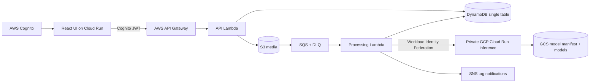

# Architecture

The user-facing trust boundary ends at API Gateway, which validates Cognito JWTs. The
processing Lambda uses a separate short-lived Google identity obtained through Workload
Identity Federation. No browser token or long-lived GCP service-account key crosses clouds.

Original objects use `originals/{mediaId}/{safeFilename}`; thumbnails use
`thumbnails/{mediaId}.jpg`; query uploads use `temporary-queries/{queryId}/{safeFilename}`
and have both immediate deletion and a one-day lifecycle fallback.
