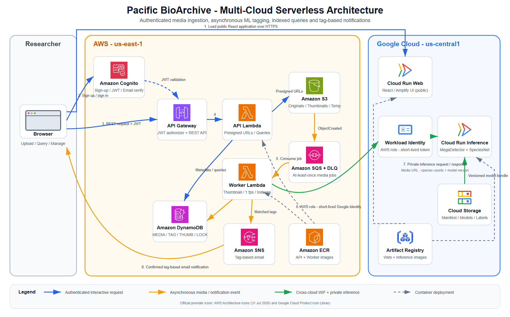

# Pacific BioArchive Team Report

## Team Details

Private repository: https://github.com/chenjunboa/PacificBioArchive

| Student name and ID | Contribution | Project elements contributed |
|---|---:|---|
| Junbo Chen, 36970271 | 25% | Local prototype, baseline REST API, SQLite/local storage workflow, initial React UI, model/inference scaffold, Terraform skeleton, repository structure, handoff documentation, and first working local validation. |
| Bingyi Wang, 36668397 | 25% | AWS/GCP deployment foundation, Cognito, API Gateway, Lambda API/Worker images, S3, SQS/DLQ, DynamoDB, SNS topic, private GCP Cloud Run inference, Artifact Registry/GCS model bundle, WIF, cost and cleanup documentation. |
| Duo Chen, 36668222 | 25% | S3-to-SQS worker handoff, Docker-free Lambda fallback, media status processing, backend task ownership for DynamoDB/S3/SQS worker, query/index/delete requirements, and issue-based backend completion planning. |
| Bo Pang, 36969842 | 25% | Final UI integration, Cognito frontend flow, upload/query/manage/notification pages, DynamoDB tag and thumbnail index stabilization, cloud smoke runner, local E2E, live image/video cloud validation, evidence and report preparation. |

## Architecture

*Figure 1. Pacific BioArchive deployment and processing flow. AWS and Google Cloud service symbols
use the providers' official architecture icon sets; source links and retrieval dates are recorded in
`docs/assets/architecture/SOURCES.md`.*

## System Overview

Pacific BioArchive is a serverless multi-cloud wildlife media archive. Authenticated users register
and sign in through AWS Cognito, then upload images or short videos through the React interface.
The API validates file type, size, checksum, and ownership, then stores media in private S3. S3
events enter SQS and are processed by the main Worker Lambda. The worker validates the uploaded
object, creates compressed thumbnails for images, samples videos at one frame per second, invokes
the private GCP inference service without a long-lived JSON key, and writes the resulting species
tags, model version, file type, URLs, and indexes to DynamoDB.

The application supports the required query flows: tag/count AND search, species search, thumbnail
URL reverse lookup, and temporary file query without permanent storage. Users can manually add or
remove tags in bulk and delete owned media; deletion removes S3 objects and related DynamoDB rows.
The UI includes sign-up, sign-in, sign-out, upload feedback, result cards, query pages, management
controls, and notification subscription controls.

## Validation Evidence

Local validation passed Python tests, Ruff, Terraform validation, frontend build, and Playwright E2E.
The local E2E covers login, image upload, duplicate checksum rejection, all four query modes, tag
editing, non-owner 403, delete cleanup, and signed-out 401.

Live cloud validation was completed on 29 August 2026 after deploying the latest `main` API and
Worker Lambda images and disabling the fallback `member3-worker` trigger. Two image smoke runs
passed through Cognito sign-in, deployed frontend upload, S3/SQS/Lambda/GCP inference, tag query,
thumbnail reverse query, delete, 404 after deletion, sign-out, and zero DynamoDB residue. A separate
3 second MP4 smoke run passed with `video/mp4`, the expected `alectura_lathami` tag, tag query,
delete, 404 after deletion, and zero DLQ messages. The Member 4 SNS email subscription was confirmed
on 30 August 2026 and rechecked by AWS CLI with a concrete subscription ARN.

## User Guide

1. Open the deployed Cloud Run web URL: https://pacific-bioarchive-prototype-web-k5t5pat3lq-uc.a.run.app/
2. Register or sign in with a verified Cognito account.
3. Upload a JPG, JPEG, PNG, MP4, or MOV file. Images must be 20 MB or smaller; videos must be 100 MB
   or smaller and 60 seconds or shorter.
4. Wait until the media reaches `READY`, then inspect tags, model version, original URL, and image
   thumbnail URL.
5. Use Search to query by tag/count, species, thumbnail URL, or temporary query file.
6. Use Manage to add/remove tags or delete owned media.
7. Use Notifications to subscribe/unsubscribe to species tag email updates. For the submitted
   evidence, the Member 4 mailbox SNS subscription has already been confirmed.
8. Sign out and confirm protected endpoints reject unauthenticated access.

## Generative AI Statement

Generative AI was used selectively for architecture planning, implementation assistance, test
design, debugging, documentation, and evidence organization. All submitted code and report claims
must be reviewed by the responsible student. The team did not commit cloud passwords, Cognito test
user passwords, email verification codes, JWTs, AWS/GCP access tokens, presigned URL query strings,
Terraform state, or model weights.

## References

- AWS Lambda, API Gateway, Cognito, S3, SQS, SNS, DynamoDB, and ECR documentation.
- Google Cloud Run, Cloud Storage, Artifact Registry, IAM Credentials, and Workload Identity
  Federation documentation.
- AWS Architecture Icons, https://aws.amazon.com/architecture/icons/ (accessed 29 August 2026).
- Google Cloud Architecture Icons, https://cloud.google.com/icons (accessed 29 August 2026).
- FIT5225 2026 S2 Assignment 2 brief and marking rubric.
